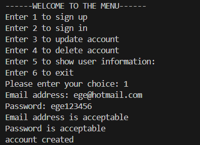
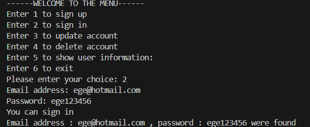
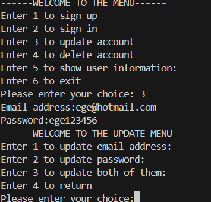
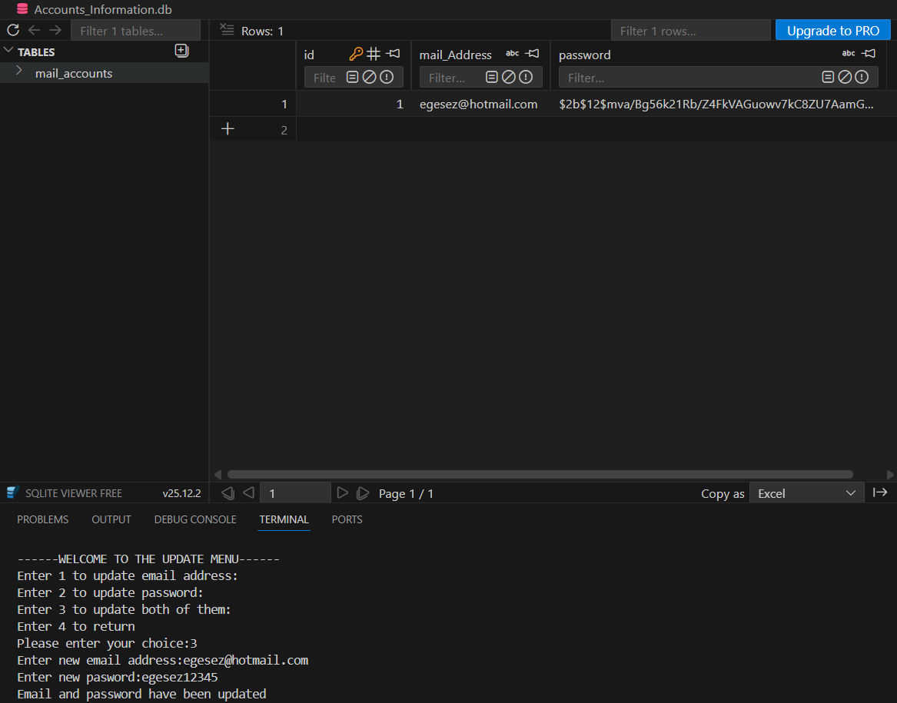
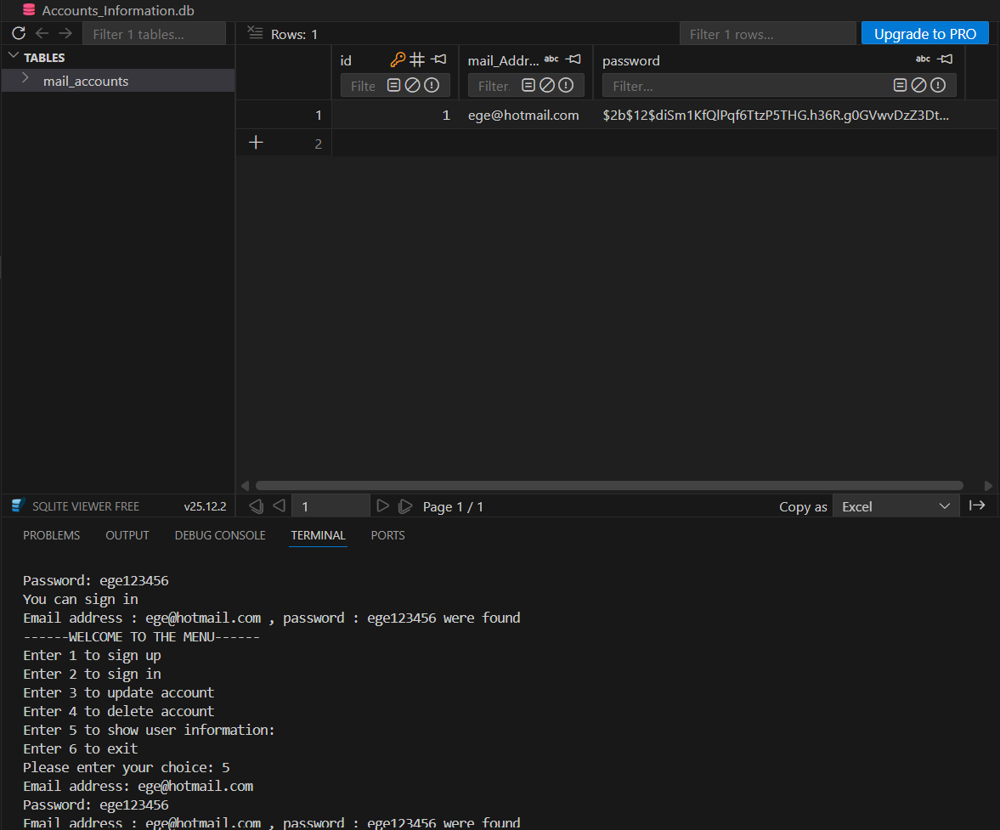

# Account Management System

This project is an **Account Management System** developed using the Python programming language and an SQLite database, enabling users to manage their accounts. 

In this **Account Management System**, users can perform the following actions:
-> Sign up (create a new account)
-> Sign in (log into their account)
-> Update account information (email or password or both of them)
-> Delete their account
-> Show user information (showing email and password information)

## Requirements

-> Python 3.14.0
-> Requirements.txt


## Installation

1) ### Clone the repository

```bash 
git clone https://github.com/Ege-Szr/Account-Management-System
```

2) ### Go to the project directory

```bash
cd Account-Management-System
```

3) ### Install dependencies

```bash
pip install -r Requirements.txt
```

4) ### Run the project

```bash
python main.py
```

## Technologies Used

--->**Python 3.14.0**

--->**SQLite3**

--->**Regular Expression Module(re)**

--->**time Module**

--->**bcrypt**

## Project Structure

```
Account-Management-System/
|
├──main.py                  
├──database.py               
├──Accounts_Information.db  
├──image/
|    ├── Menu.png
|    ├── sign_up.png
|    ├── sign_in.png
|    ├── update_account_1.png
|    ├── update_account_2.png
|    ├── show_user_information.png
├──README.md 
└──requirements.txt            
```

## Project Features

-> User sign up with input validation
-> User login system
-> Update user account information
-> User account deletion functionality
-> Email and password validation using Regular Expressions (re)
-> Data storage using SQLite database
-> Error handling using try-except blocks

## How to use 

### Run

```bash
python main.py
```

### Main Menu

-> After the running the program,a "Welcome to the menu" message and available options will be displayed.


### Sign up 

-> Users can create a new account by entering a valid email address and password.




### Sign in

-> Users can log in with their registered email and password.




### Update Account

-> Users can update their email, password, or both after verifying their current password.

 


### Show User Information

-> Users can view their stored account information after verifying their credentials.



## Security Notes

-> Passwords are hashed with bcrypt before being stored.
-> Email and password inputs are validated with regex patterns.
-> Database enforces unique email addresses.


